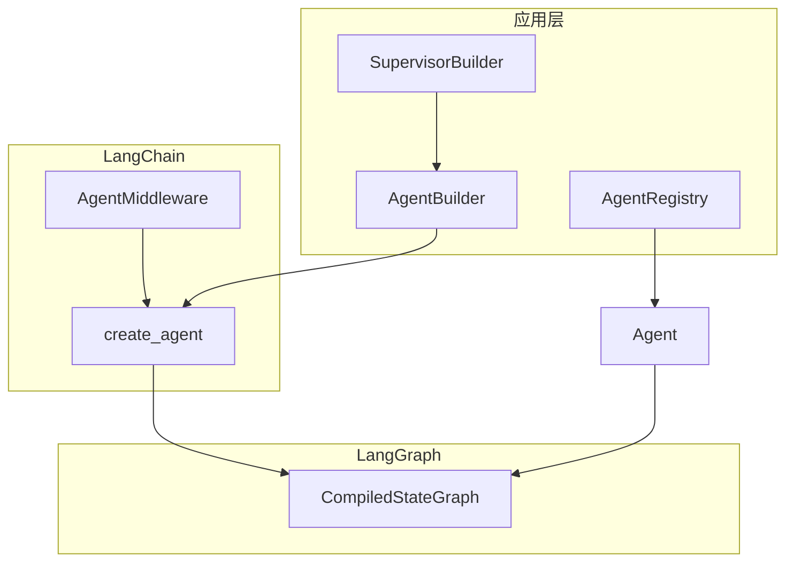

# LangWeave · 织语

**LangWeave**（织语）是基于 **LangChain 1.x** 与 **LangGraph** 的 Python Agents 框架：在官方 `create_agent` 之上提供统一构建、注册、多 Agent 编排与 FastAPI Web 服务。

> **命名**：Weave = 编织 —— 将模型、工具、中间件与多个 Agent 编织成可运行的图。

## 架构



| 模块 | 职责 |
|------|------|
| `AgentBuilder` | 流式配置 model / tools / middleware / checkpointer |
| `Agent` | 封装 `invoke` / `stream` / `chat`，支持 `thread_id` |
| `AgentRegistry` | 按名称注册与获取 Agent |
| `ToolRegistry` | 按分组管理工具 |
| `LoggingMiddleware` | 记录 model 与 tool 调用 |
| `SupervisorBuilder` | 监督者模式，将子 Agent 包装为 handoff 工具 |

## 快速开始（DeepSeek）

```bash
pip install -r requirements.txt
cp .env.example .env
# 编辑 .env，填入 DEEPSEEK_API_KEY（启动时会自动加载，无需手动 export）
```

`.env` 示例：

```env
DEEPSEEK_API_KEY=sk-your-key
LANGWEAVE_MODEL=deepseek:deepseek-chat
```

```python
from langweave import AgentBuilder
from langweave.tools import calculator

agent = (
    AgentBuilder()
    .with_name("math")
    .with_deepseek("deepseek-chat", temperature=0.3)
    .with_tools([calculator])
    .with_system_prompt("Use tools for arithmetic.")
    .build()
)

print(agent.chat("99 * 101 等于多少？"))
```

也可直接写模型字符串或使用工厂函数：

```python
from langweave import AgentBuilder, chat_model

agent = AgentBuilder().with_model(chat_model("deepseek-chat")).build()
# 或: .with_model("deepseek:deepseek-reasoner")
```

### OpenAI（可选）

```bash
pip install langchain-openai
export OPENAI_API_KEY=sk-...
export LANGWEAVE_MODEL=openai:gpt-4o-mini
```

## FastAPI Web 服务

```bash
pip install -r requirements.txt
uvicorn main:app --reload --port 8000
```

| 方法 | 路径 | 说明 |
|------|------|------|
| GET | `/health` | 健康检查 |
| GET | `/api/v1/agents` | 列出已注册 Agent |
| POST | `/api/v1/agents/{name}/chat` | 对话，返回文本 |
| POST | `/api/v1/agents/{name}/invoke` | 完整状态（含 messages） |
| POST | `/api/v1/agents/{name}/stream` | SSE 流式输出 |

```bash
curl -X POST http://127.0.0.1:8000/api/v1/agents/assistant/chat \
  -H "Content-Type: application/json" \
  -d '{"message": "What is 12 * 8?"}'
```

自定义应用：

```python
from langweave import AgentBuilder
from langweave.registry import AgentRegistry
from langweave.web import create_app

def setup(registry: AgentRegistry) -> None:
    agent = AgentBuilder().with_name("demo").with_model("openai:gpt-4o-mini").build()
    registry.register(agent)

app = create_app(on_startup=setup)
```

### API 文档（目录树 + Swagger 2）

默认 **按 URL 目录层级** 展示接口（左树右详情），规范仍为 Swagger 2.0：

| 地址 | 说明 |
|------|------|
| [http://127.0.0.1:8000/docs](http://127.0.0.1:8000/docs) | **目录树文档**（可在线填参并「发送请求」） |
| [http://127.0.0.1:8000/docs/swagger](http://127.0.0.1:8000/docs/swagger) | 经典 Swagger UI |
| [http://127.0.0.1:8000/swagger.json](http://127.0.0.1:8000/swagger.json) | Swagger 2.0 JSON |

```bash
uvicorn main:app --reload --port 8000
```

`setup_swagger2(..., docs_mode="tree")`；若要仅经典 Swagger UI：`docs_mode="swagger"`。

元数据见 `langweave/web/openapi.py`，目录页实现见 `langweave/web/tree_docs.py`。

### 业务层说明

| 目录 | 职责 |
|------|------|
| `app/agents/` | 组装并注册业务 Agent（见 `registry_setup.py`） |
| `app/tools/` | 领域工具，在 `builtin.py` 中汇总 |
| `app/services/` | 用例服务，封装校验与 Agent 调用 |
| `app/handlers/` | 多步工作流、异步任务 |
| `app/api/` | 扩展 REST 路由（挂到 `main.py`） |

新增 Agent：在 `app/agents/` 增加模块，并在 `registry_setup.py` 里 `register`。

### 接口里用 Agent 做意图识别

流程：**专用 `intent` Agent（结构化输出）→ `IntentService` → HTTP 路由**

```
POST /api/v1/intent/recognize   # 只识别意图
POST /api/v1/intent/chat        # 识别 + 路由到 target_agent 并回复
```

```bash
# 仅意图识别
curl -X POST http://127.0.0.1:8000/api/v1/intent/recognize \
  -H "Content-Type: application/json" \
  -d '{"message": "帮我查订单10001到哪了"}'

# 识别后自动交给 assistant 处理
curl -X POST http://127.0.0.1:8000/api/v1/intent/chat \
  -H "Content-Type: application/json" \
  -d '{"message": "帮我查订单10001到哪了"}'
```

响应示例（`/recognize`）：

```json
{
  "intent": {
    "intent": "order_query",
    "confidence": 0.91,
    "slots": {"order_id": "10001"},
    "target_agent": "assistant",
    "reasoning": "用户询问订单物流"
  }
}
```

代码中调用（非 HTTP）：

```python
from app.services import IntentService
from langweave.web.deps import get_registry  # 或自建 AgentRegistry

service = IntentService(registry)
intent = await service.recognize("查订单10001")
result = await service.recognize_and_chat("查订单10001")  # 含 reply
```

直接调某个 Agent（无意图层）仍用：

```bash
POST /api/v1/agents/{agent_name}/chat
POST /api/v1/agents/intent/chat   # intent agent 只做分类（结构化输出在 invoke 里）
```

### 多轮对话记忆

`assistant`、`emotional` 已启用 LangGraph **checkpointer**（内存会话，重启服务后清空）。

1. 首次对话可不传 `thread_id`，响应 `data.thread_id` 会返回会话 ID  
2. 后续请求带上同一 `thread_id`，Agent 会记住此前消息  

```bash
# 第一轮
curl -X POST http://127.0.0.1:8000/api/v1/agents/emotional/chat \
  -H "Content-Type: application/json" \
  -d '{"message": "最近很焦虑"}'
# 记下返回的 data.thread_id

# 第二轮（同一 thread_id）
curl -X POST http://127.0.0.1:8000/api/v1/agents/emotional/chat \
  -H "Content-Type: application/json" \
  -d '{"message": "还是睡不着", "thread_id": "上一步的-thread-id"}'
```

| 接口 | 说明 |
|------|------|
| `GET /api/v1/sessions/{agent}/{thread_id}` | 查看会话历史 |
| `DELETE /api/v1/sessions/{agent}/{thread_id}` | 清空该会话记忆 |

关闭记忆：`LANGWEAVE_MEMORY_ENABLED=false`

## 多 Agent（Supervisor）

```python
from langweave import AgentBuilder
from langweave.orchestration import SupervisorBuilder

researcher = AgentBuilder().with_name("researcher").with_model(model).build()
coder = AgentBuilder().with_name("coder").with_model(model).build()

supervisor = SupervisorBuilder(
    {"researcher": researcher, "coder": coder},
    model=model,
).build()

print(supervisor.chat("Explain async/await and give a tiny example."))
```

## 环境变量

| 变量 | 说明 |
|------|------|
| `DEEPSEEK_API_KEY` | DeepSeek API 密钥（推荐） |
| `LANGWEAVE_MODEL` | 默认模型（默认 `deepseek:deepseek-chat`） |
| `LANGWEAVE_TEMPERATURE` | 采样温度 |
| `LANGWEAVE_MAX_TOKENS` | 最大生成 token |
| `LANGWEAVE_SYSTEM_PROMPT` | 默认 system prompt |
| `LANGWEAVE_DEBUG` | 设为 `true` 开启 LangGraph debug |
| `OPENAI_API_KEY` | 使用 OpenAI 模型时配置 |

## 测试

```bash
pip install pytest
pytest tests/ -q
```

测试使用 `FakeMessagesListChatModel`，无需 API Key。

## 目录结构

```
langweave/            # 框架层（通用 Agent 能力）
  agent.py
  builder.py
  config.py
  models/
  registry.py
  middleware/
  tools/              # 框架内置工具（calculator 等）
  orchestration/
  web/                # 通用 HTTP API
app/                  # 业务层（你的应用逻辑）
  agents/             # Agent 定义与注册
  tools/              # 业务工具（如订单查询）
  services/           # 业务服务（ChatService 等）
  handlers/           # 复杂流程 / 批处理
  api/                # 可选：业务专属 HTTP 路由
main.py               # 入口，仅组装框架 + 业务
examples/
tests/
```

## 与 LangChain 的关系

本框架**不替代** LangChain Agent API，而是：

1. 用 `create_agent` 编译 LangGraph 图
2. 复用官方 `AgentMiddleware` 生态（如 `ModelRetryMiddleware`、`SummarizationMiddleware`）
3. 在应用层补充注册表、监督者编排与内置工具

可直接在 `AgentBuilder.with_middleware()` 中接入 [LangChain 内置中间件](https://docs.langchain.com/oss/python/langchain/middleware)。
