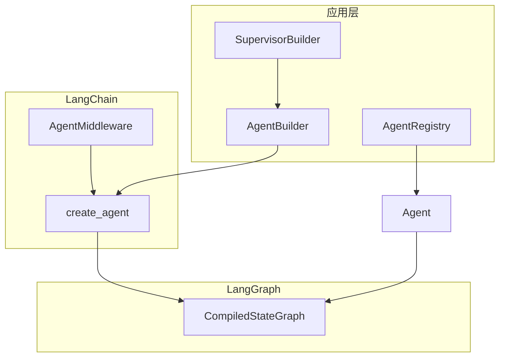

# LangWeave · 织语

**LangWeave**（织语）是基于 **LangChain 1.x** 与 **LangGraph** 的 Python Agents 框架：在官方 `create_agent` 之上提供统一构建、注册、多 Agent 编排与 FastAPI Web 服务。

> **命名**：Weave = 编织 —— 将模型、工具、中间件与多个 Agent 编织成可运行的图。

## 架构



| 模块 | 职责 |
|------|------|
| `AgentBuilder` | 流式配置 model / tools / middleware / checkpointer |
| `Agent` | 封装 `invoke` / `stream` / `chat`，支持 `thread_id` |
| `AgentRegistry` | 按名称注册与获取 Agent |
| `ToolRegistry` | 按分组管理工具 |
| `LoggingMiddleware` | 记录 model 与 tool 调用 |
| `SupervisorBuilder` | 监督者模式，将子 Agent 包装为 handoff 工具 |

## 快速开始（DeepSeek）

```bash
pip install -r requirements.txt
cp .env.example .env
# 编辑 .env，填入 DEEPSEEK_API_KEY（启动时会自动加载，无需手动 export）
```

`.env` 示例：

```env
DEEPSEEK_API_KEY=sk-your-key
LANGWEAVE_MODEL=deepseek:deepseek-chat
```

```python
from langweave import AgentBuilder
from langweave.tools import calculator

agent = (
    AgentBuilder()
    .with_name("math")
    .with_deepseek("deepseek-chat", temperature=0.3)
    .with_tools([calculator])
    .with_system_prompt("Use tools for arithmetic.")
    .build()
)

print(agent.chat("99 * 101 等于多少？"))
```

也可直接写模型字符串或使用工厂函数：

```python
from langweave import AgentBuilder, chat_model

agent = AgentBuilder().with_model(chat_model("deepseek-chat")).build()
# 或: .with_model("deepseek:deepseek-reasoner")
```

### OpenAI（可选）

```bash
pip install langchain-openai
export OPENAI_API_KEY=sk-...
export LANGWEAVE_MODEL=openai:gpt-4o-mini
```

## FastAPI Web 服务

```bash
pip install -r requirements.txt
uvicorn main:app --reload --port 8000
```

| 方法 | 路径 | 说明 |
|------|------|------|
| GET | `/health` | 健康检查 |
| GET | `/api/v1/agents` | 列出已注册 Agent |
| POST | `/api/v1/agents/{name}/chat` | 对话，返回文本 |
| POST | `/api/v1/agents/{name}/invoke` | 完整状态（含 messages） |
| POST | `/api/v1/agents/{name}/stream` | SSE 流式输出 |

```bash
curl -X POST http://127.0.0.1:8000/api/v1/agents/assistant/chat \
  -H "Content-Type: application/json" \
  -d '{"message": "What is 12 * 8?"}'
```

自定义应用：

```python
from langweave import AgentBuilder
from langweave.registry import AgentRegistry
from langweave.web import create_app

def setup(registry: AgentRegistry) -> None:
    agent = AgentBuilder().with_name("demo").with_model("openai:gpt-4o-mini").build()
    registry.register(agent)

app = create_app(on_startup=setup)
```

文档：启动后访问 `http://127.0.0.1:8000/docs`。

## 多 Agent（Supervisor）

```python
from langweave import AgentBuilder
from langweave.orchestration import SupervisorBuilder

researcher = AgentBuilder().with_name("researcher").with_model(model).build()
coder = AgentBuilder().with_name("coder").with_model(model).build()

supervisor = SupervisorBuilder(
    {"researcher": researcher, "coder": coder},
    model=model,
).build()

print(supervisor.chat("Explain async/await and give a tiny example."))
```

## 环境变量

| 变量 | 说明 |
|------|------|
| `DEEPSEEK_API_KEY` | DeepSeek API 密钥（推荐） |
| `LANGWEAVE_MODEL` | 默认模型（默认 `deepseek:deepseek-chat`） |
| `LANGWEAVE_TEMPERATURE` | 采样温度 |
| `LANGWEAVE_MAX_TOKENS` | 最大生成 token |
| `LANGWEAVE_SYSTEM_PROMPT` | 默认 system prompt |
| `LANGWEAVE_DEBUG` | 设为 `true` 开启 LangGraph debug |
| `OPENAI_API_KEY` | 使用 OpenAI 模型时配置 |

## 测试

```bash
pip install pytest
pytest tests/ -q
```

测试使用 `FakeMessagesListChatModel`，无需 API Key。

## 目录结构

```
langweave/
  agent.py          # Agent 封装
  builder.py        # AgentBuilder（含 with_deepseek）
  config.py         # AgentSettings
  models/           # DeepSeek 等模型辅助
  registry.py       # AgentRegistry
  middleware/       # 自定义中间件
  tools/            # 工具与 ToolRegistry
  orchestration/    # Supervisor / handoff
  web/              # FastAPI 路由与应用工厂
main.py             # uvicorn 入口
examples/
tests/
```

## 与 LangChain 的关系

本框架**不替代** LangChain Agent API，而是：

1. 用 `create_agent` 编译 LangGraph 图
2. 复用官方 `AgentMiddleware` 生态（如 `ModelRetryMiddleware`、`SummarizationMiddleware`）
3. 在应用层补充注册表、监督者编排与内置工具

可直接在 `AgentBuilder.with_middleware()` 中接入 [LangChain 内置中间件](https://docs.langchain.com/oss/python/langchain/middleware)。
